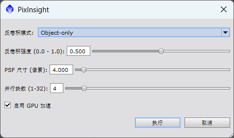

# GraXpertDeconvolution.js — PixInsight 调用 GraXpert 反卷积

这是一个 **PixInsight 脚本**（PJSR），用于在 PixInsight 中直接调用 **GraXpert 3.x** 的 AI 反卷积（Deconvolution）功能，无需离开 PixInsight 手动打开 GraXpert。


## 功能

- 将当前 PixInsight 活动图像自动保存为临时 FITS 文件
- 调用 GraXpert 命令行接口执行反卷积
- 支持两种反卷积模式：
  - **Object-only**（深空天体）
  - **Stars-only**（恒星）
- 可调节强度、PSF 尺寸、并行块数、GPU 加速等参数
- 处理完成后自动将结果加载回 PixInsight 新窗口
- 自动清理临时文件

## 依赖

- **PixInsight 1.8.8+**（支持 PJSR）
- **GraXpert 3.x**（≥ 3.0，带反卷积功能）

### 安装 GraXpert

从官网下载安装：<https://github.com/Steffenhir/GraXpert/releases>

- Windows：`.msi` 安装包
- 或通过 pip 安装（需 Python 3.11+）：
  ```bash
  pip install graxpert
  ```

## 安装脚本到 PixInsight

1. 打开 PixInsight
2. 菜单 **Scripts → Feature Scripts**
3. 点击 **Add**，选择本文件 `GraXpertDeconvolution.js`
4. 脚本会出现在 **Scripts** 菜单下，可随时运行

## 使用步骤

1. 在 PixInsight 中打开一张**线性**图像（反卷积应在拉伸前进行）
2. 运行 **Scripts → GraXpertDeconvolution**
3. 首次运行会提示选择 GraXpert 可执行文件路径（之后会自动记住）
4. 在弹出的对话框中设置反卷积参数
5. 等待处理完成，结果会在新窗口中打开

## 参数说明

| 参数 | 说明 | 默认值 |
|------|------|--------|
| 反卷积模式 | Object-only 或 Stars-only | Object-only |
| 反卷积强度 | 0.0 - 1.0，越高效果越强 | 0.5 |
| PSF 尺寸 | 期望反卷积的星点/视宁度尺寸（像素） | 4 |
| 并行块数 | 同时处理的图像块数，越大越快但更耗内存 | 4 |
| GPU 加速 | 使用 GPU 加速 AI 推理 | 开启 |

## 工作原理

脚本执行以下 GraXpert 命令行命令：

```bash
GraXpert-win64.exe -cli -cmd deconv-obj <input.fits> -output <output> -strength 0.5 -psfsize 0.3 -batch_size 4 -gpu true
```

- `-cli`：强制使用命令行模式
- `-cmd deconv-obj` / `-cmd deconv-stellar`：选择反卷积类型
- 输出文件为 32 位 FITS，保留原始 FITS 头信息

## 常见问题

**Q: 脚本提示找不到 GraXpert 可执行文件？**
A: 首次运行时需通过文件对话框选择 `GraXpert-win64.exe`（或 macOS 的 `GraXpert.app/Contents/MacOS/GraXpert`）的位置。

**Q: 反卷积失败，退出码非 0？**
A: 检查 PixInsight 控制台输出的错误信息，确认输入图像为线性图像、PSF 尺寸设置合理。

**Q: 可以反卷积 XISF 格式吗？**
A: 脚本以 FITS 格式保存输入并加载输出，支持从任意 PixInsight 图像处理，结果以 FITS 加载回 PixInsight。

## 注意事项

- 反卷积应在**线性数据**上进行，不要在拉伸后使用
- 首次运行反卷积时 GraXpert 可能需要下载 AI 模型（需联网）
- 大图像反卷积耗时较长，请耐心等待
